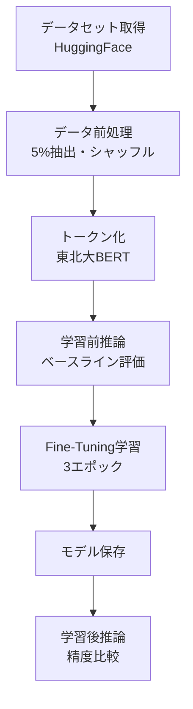
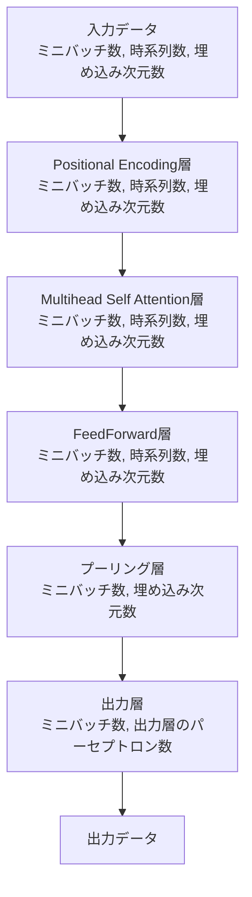

# このフォルダのプログラムについて

このフォルダのmainプログラム(main.ipynb)は、Hugging Faceのtransformersライブラリーの勉強を兼ねて、東北大のBERTモデルにて、Fine Tuning前での文章分類の精度と、Fine Tuning後での文章分類の精度を比較してみたものになります。 
&nbsp;(numpy： 2.0.2) 
&nbsp;(pandas： 2.2.2) 
&nbsp;(torch： 2.6.0+cu124) 
&nbsp;(transformers： 4.50.2) 
&nbsp;(datasets： 3.5.0) 

---

# プログラムの全体フロー

**目的**: 日本語感情分類(positive/neutral/negative)のFine-Tuning

---

**データセットとトークン化**
- データ: `tyqiangz/multilingual-sentiments` (日本語) の5%を使用
- ラベル: 3クラス (positive / neutral / negative)
- トークナイザー: `cl-tohoku/bert-base-japanese-whole-word-masking`

**Fine-Tuning**
- エポック数: 3 / ミニバッチ: 32 / 学習率: 2e-5
- 評価指標: Accuracy / Precision / Recall / F1-Score

**推論と比較**
- 学習前: ベースライン性能を測定
- 学習後: 保存したモデルで再推論し、Accuracy向上を検証

---

**実装内容**
1. データ取得: HuggingFaceから日本語感情分析データセット
2. 前処理: データ削減(5%)、シャッフル、ラベル変換
3. トークン化: 東北大BERTトークナイザーで変換
4. 学習前評価: ベースライン性能の測定
5. Fine-Tuning: 3エポックの学習実行
6. モデル保存: 重み・設定・トークナイザーを保存
7. 学習後評価: 精度向上の検証

**結果**: Fine-Tuning前後のAccuracy比較により効果を検証

---

## 補足(BERTのデータ形状(shape)の流れ)

**【前提】**

- ミニバッチ処理を行う。
- 文章分類タスクを想定。
  - 時系列数はトークン数のこと。
- 埋め込み次元数とは、例えば768などのEmbeddingの次元数を指す。

**入力〜出力のデータフロー**

**ポイント**

プーリング層では、`[CLS]`トークンの埋め込みベクトルを抽出する処理を行う。 
通常、時系列の最初の位置（0番目）には `[CLS]` トークンが配置されているので、これに対応するベクトルを抽出する。 
具体的には、出力テンソルの形状 `(ミニバッチ数, 時系列数, 埋め込み次元数)` から、`[CLS]` トークンに該当する部分だけを取り出す事で、 
 `(ミニバッチ数, 1, 埋め込み次元数)` になるので、これをsqueezeする事で、 `(ミニバッチ数, 埋め込み次元数)` になる。 
このテンソルが出力的な文章表現として、出力層に渡される。
