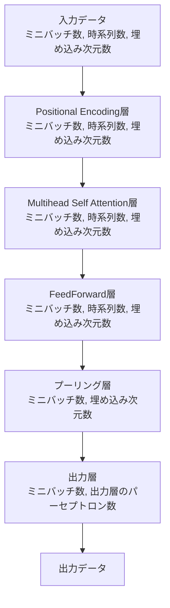

# このフォルダのプログラムについて

このフォルダのmainプログラム(main.ipynb)は、Hugging Faceのtransformersライブラリーの勉強を兼ねて、東北大のBERTモデルにて、Fine Tuning前での文章分類の精度と、Fine Tuning後での文章分類の精度を比較してみたものになります。 
(ライブラリーのバージョンはmain.ipynb側に記載)

# 補足(BERTのデータ形状(shape)の流れ)

## 【前提】

- **ミニバッチ処理**を行う。
- **文章分類タスク**を想定。
  - 時系列数とは、トークン数のこと。
- **埋め込み次元数**とは、例えば768などのEmbeddingの次元数を指す。

---

## 入力〜出力のデータフロー

---

## ポイント

**プーリング層**では、`[CLS]`トークンの埋め込みベクトルを抽出する処理を行う。 
通常、時系列の最初の位置（0番目）には `[CLS]` トークンが配置されているので、これに対応するベクトルを抽出する。 
具体的には、出力テンソルの形状 `(ミニバッチ数, 時系列数, 埋め込み次元数)` から、`[CLS]` トークンに該当する部分だけを取り出す事で、 
&nbsp;&nbsp;&nbsp;&nbsp;(ミニバッチ数, 1, 埋め込み次元数) 
そして、これをsqueezeする事で、 
&nbsp;&nbsp;&nbsp;&nbsp;(ミニバッチ数, 埋め込み次元数) 
となり、このテンソルが出力的な文章表現として、出力層に渡される。
