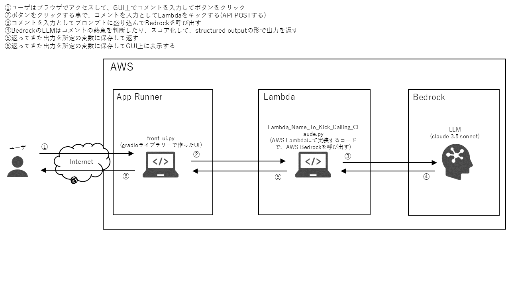

# このフォルダのプログラムについて

このフォルダのプログラムは、AIアプリの理解を深めるために、コメントの熱意をLLMを使って判定するwebアプリを作成したものです。

## 概要

フロントは、gradioライブラリーでプログラムを作り、dockerイメージにしたものをAWSのApp Runnerで動かします。

バックは、AWS Lambda上でboto3ライブラリーでAWS Bedrockを呼び出すものになります。

ユーザは、ブラウザでGUIにアクセスして、熱意を判定したいコメントを入力してボタンをクリックする事で、
LLMによる判定結果を確認出来ます。

以下に、mainプログラムの概要図と処理フローを示す図を掲載します。

