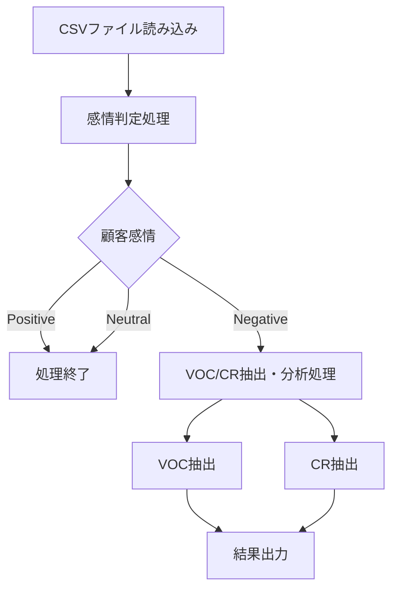
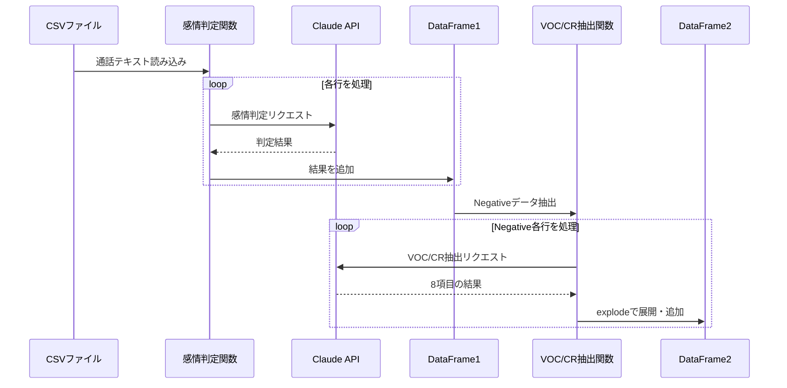
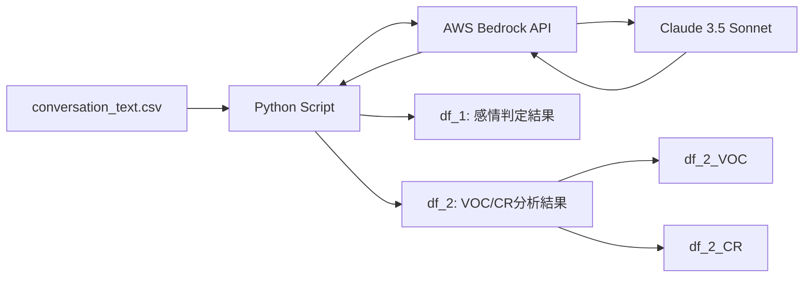

# このフォルダのプログラムについて

このフォルダのmainプログラム(main.py)は、claudeのtool_useでstructured outputを行って、音声通話テキストの自然文を構造化データにします。

# プログラム概要

コンタクトセンターの通話テキストデータを分析し、顧客の声(VOC)とコンタクトリーズン(CR)を抽出・分類します。

**使用してる仕組み**
- LLM: AWS Bedrock (Claude 3.5 Sonnet)
- 処理方式: Function Calling (Structured Output)
- データ処理: pandas, csv

---

## 処理フロー

---

## 第1段階: 感情判定処理

**入力データ**
- `conversation_text.csv` から通話テキストを読み込み

**処理内容**
- Claude 3.5 Sonnetを使用して顧客感情を3段階で判定
  - Positive (ポジティブ)
  - Neutral (ニュートラル)
  - Negative (ネガティブ)

**出力**
- 通話テキスト、感情判定結果をDataFrameに格納

---

## 第2段階: VOC/CR抽出・分析処理

**処理対象**
- 第1段階でNegativeと判定されたデータのみ

**抽出項目 (8項目)**
1. VOC/CRの内容抽出
2. VOC/CR分類
3. カテゴリ分類
4. 対象(サービス名・手続き内容)
5. 発生事象
6. 顧客の評価・感情
7. 理由(経緯・背景)
8. 顧客の期待(解決策)

---

## VOCとCRの定義

| 特徴項目 | CR | VOC |
|---------|-----|-----|
| **目的** | タスク完了、情報取得、問題解決 | 感情・意見の表明、改善要求 |
| **性質** | 客観的な事実、行動、要求 | 主観的な意見、感情、評価 |
| **問い** | What(何をしたか、何を求めたか) | Why/How(なぜ・どう感じたか) |
| **具体例** | 「注文内容を変更したい」 | 「変更手続きができないのは不便」 |

---

## VOC/CR分類カテゴリ

| カテゴリ | 具体的な内容 |
|---------|------------|
| **手続きの問題(新規)** | 申し込み手順の複雑さ、必要書類の多さ |
| **手続きの問題(変更)** | プラン変更、変更手続きの煩雑さ |
| **手続きの問題(解約)** | 解約方法の分かりにくさ、引き止め |
| **工事・設置の問題** | 予約困難、期間長期化、作業品質・態度 |
| **料金・請求の問題** | 想定外の料金、請求内容の不明瞭さ |

---

## データ処理の流れ

---

## プログラム構成

