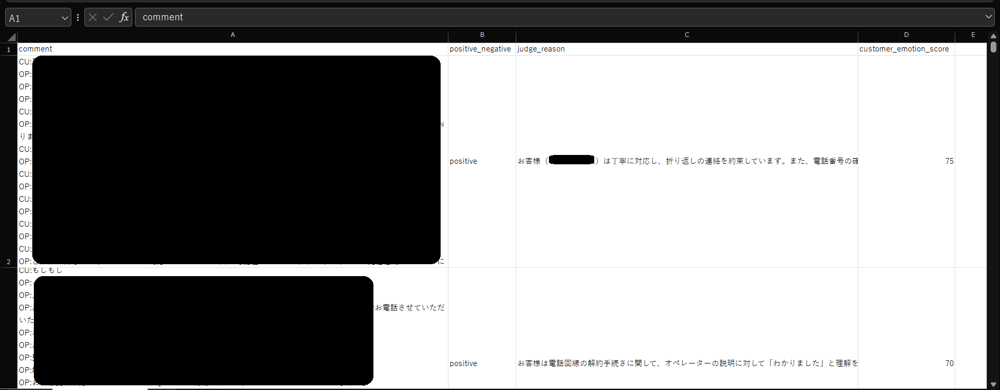

# このフォルダのプログラムについて

このフォルダのmainプログラム(main.ipynb)は、claudeのtool_useでstructured outputを行って、音声通話テキストの自然文を構造化データにします。

## 概要

音声通話テキストの自然文を入力として、

- お客様(CU)の感情はポジティブかネガティブか
- 上記の判定を行った理由
- お客様の感情をスコア化

をclaudeがそれぞれ出力した後、pandasのdataframeや、csvファイルに加工するプログラムです。 
結果は下図のような形になります。

