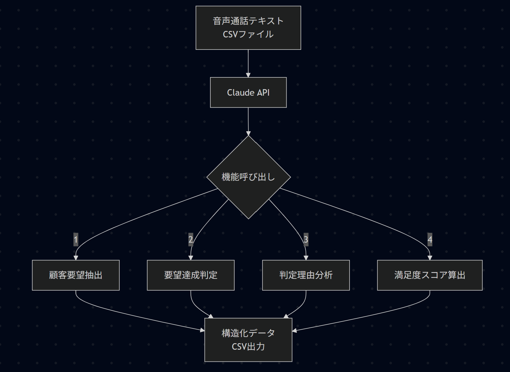
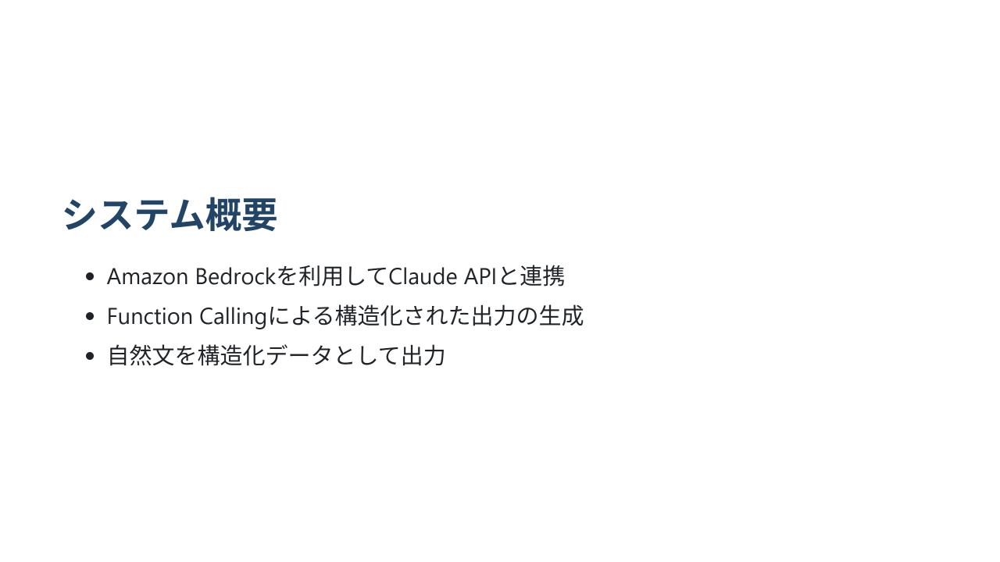
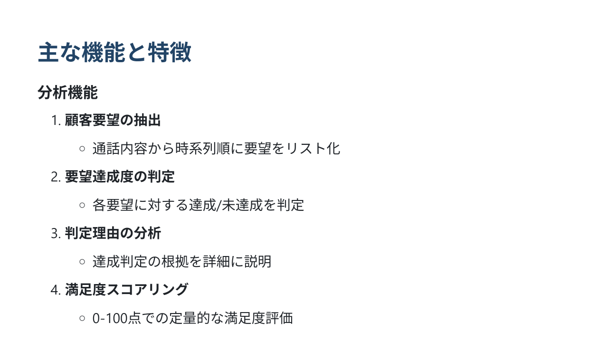
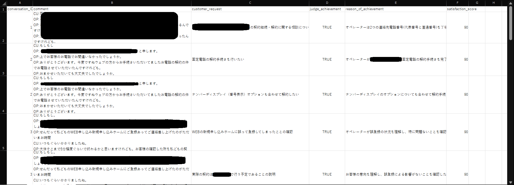

# このフォルダのプログラムについて

このフォルダのmainプログラム(main.ipynb)は、claudeのtool_useでstructured outputを行って、音声通話テキストの自然文を構造化データにします。 
　(boto3バージョン： 1.40.21) 
　(pandasバージョン： 2.3.0)

## 概要

## 詳細

音声通話テキストの自然文を入力として、

1. コンタクトセンターに電話を掛けてきたお客様(CU)の要望
2. 上記の要望をオペレータが満たせたかどうか (True / False)
3. そのように判断した理由
4. お客様の満足度をスコア化

をclaudeがそれぞれ出力した後、pandasのdataframeや、csvファイルに加工するプログラムです。 
ポイントとして、1つの音声通話テキストに対して「お客様の要望」を複数抽出して、抽出したもの毎に「オペレータがそれを満たせたか」「判断した理由」を出力します。 
　※「スコア」は1つの音声通話テキストに対して1つの出力にしていますので、同じ音声通話テキストならば全て同じ値になります。 

## 結果のサンプル
下図のようなcsvファイルの形になります。

1. C列(customer_request)
2. D列(judge_achievement)
3. E列(reason_of_achievement)
4. F列(satisfaction_score)

