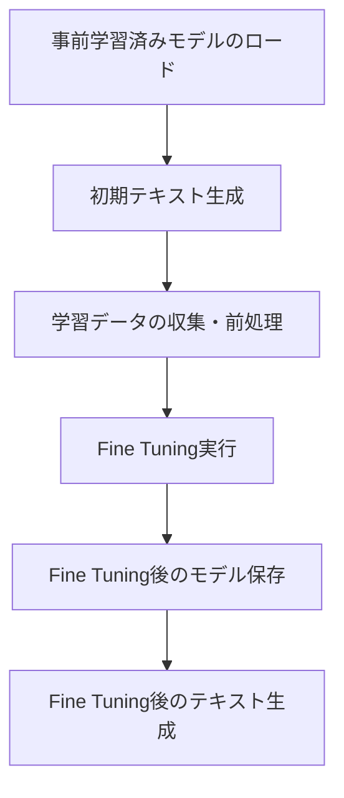
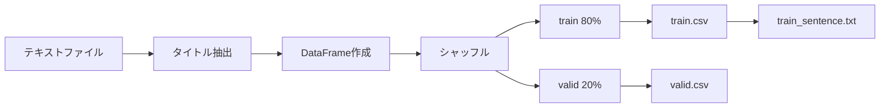
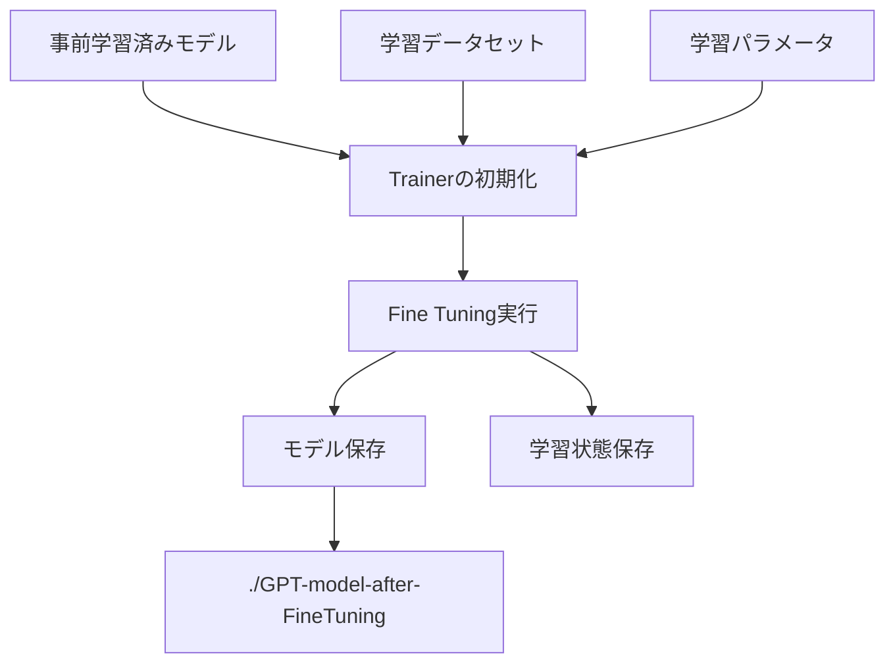

# このフォルダのプログラムについて

このフォルダのmainプログラム(main.ipynb)は、Hugging Faceのtransformersライブラリーの勉強を兼ねて、rinna社のGPTモデルにて文章生成と、Fine Tuningと、Fine Tuning後での文章生成を試してみたものになります。 

---

# プログラムの全体構成

---

## 1. 事前学習済みモデルのロードと初期テキスト生成

**使用モデル**
- モデル: `rinna/japanese-gpt2-medium`
- タスク: 因果的言語モデル (Causal Language Model)

**初期テキスト生成の設定**
- 入力プロンプト: "お勧めのライフハックと言えば、"
- 生成パラメータ:
  - 最大長: 100トークン
  - 最小長: 20トークン
  - 生成文章数: 3つ
  - サンプリング手法: Top-k (500) + Top-p (0.95)

---

## 2. 学習データの収集と前処理

**データソース**
- データセット: ldcc-20140209 (livedoorニュースコーパス)
- 対象カテゴリ: `it-life-hack`

**データ処理フロー**

---

## 3. Fine Tuning実行フロー

**主要な学習設定**
- 学習率: 2e-5、重み減衰: 0.01
- バッチサイズ: 8、エポック数: 3
- block_size: 128トークン、FP16精度

---
