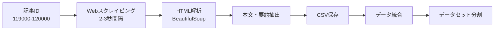
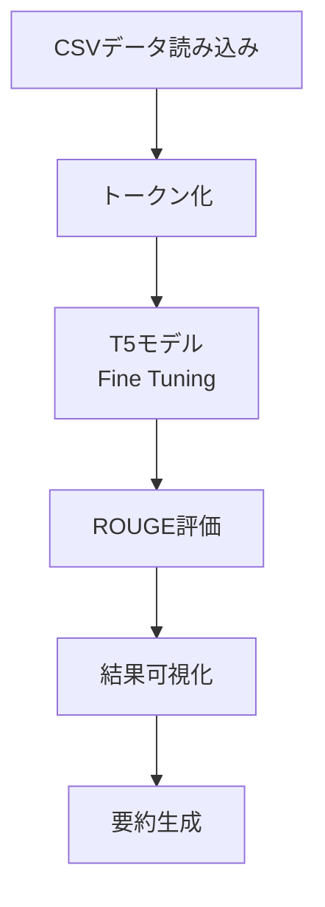
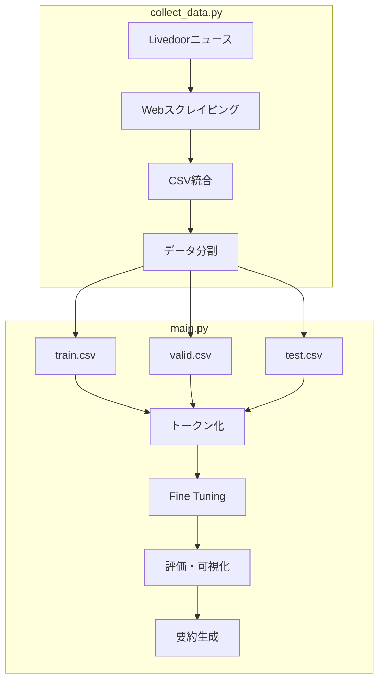

# このフォルダのプログラムについて

このフォルダのmainプログラム(main.ipynb)は、Hugging Faceのtransformersライブラリーの勉強を兼ねて、事前学習済みのT5モデルに文章要約のFine Tuningを行って、Fine Tuning後のモデルで文章要約を試してみたものになります。 
また、collect_data.ipynbは文章要約のFine Tuningを行うにあたっての学習データを収集するためのものになります。

---

# 構成

2つの主要プログラム

1. **collect_data.py**
- ニュース記事のスクレイピング
- データセットの作成と分割

2. **main.py**
- T5モデルのFine Tuning
- 要約生成と評価

---

## collect_data.py の機能

**データ収集プロセス**

---

## main.py の機能

**主要処理フロー**

---

**使用モデルとライブラリ**

T5モデル
- モデル名: `sonoisa/t5-base-japanese`
- 事前学習済み日本語T5モデル

主要ライブラリ
- transformers: T5モデルの実装
- datasets: データセット管理
- evaluate: ROUGE評価指標
- torch: ディープラーニングフレームワーク

---

## 全体のワークフロー

---

## 技術的特徴: collect_data.py

**エラーハンドリング**
- データ検証: 本文・要約が存在しない場合はスキップ

**データ品質管理**
- データシャッフルによる偏り防止
- エンコーディング対応（EUC-JP / Shift-JIS）

---

## 技術的特徴: main.py

**評価と可視化**
- ROUGE-1, ROUGE-2, ROUGE-Lによる多角的評価
- 複数エポックのスコア推移をグラフ化

**処理の最適化**
- 特殊トークンの除去による出力品質向上
